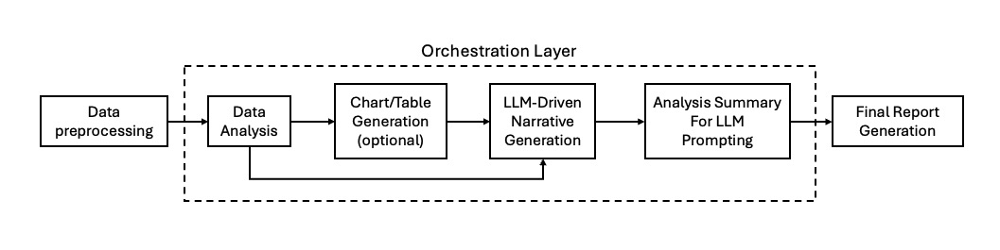
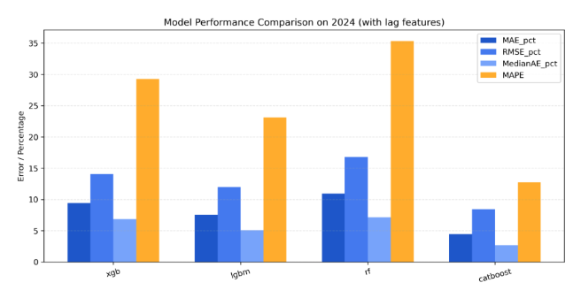

# Executive Summary

## 1. Project Deliverables
This project successfully produced a fully reproducible Python codebase that performs **end-to-end automated report generation**.

- **Input:** Structured dataset (Excel / CSV)  
- **Output:** Complete business report in: `.md` (Markdown) or `.html` (HTML) or `.pdf` (PDF)

## 2. Solution Architecture and Design Choices

### 2.1 Workflow Pipeline

{.img-full}

The workflow integrates data preprocessing, metric computation, LLM-guided analysis, visualization generation, and automated report assembly into a unified, reproducible pipeline. Its modular three-stage design—clean data foundation, LLM-orchestrated analytical reasoning, and structured multi-format report generation—enables a fully automated and scalable transformation of raw structured data into actionable insights.

#### Step 1 — Data Preprocessing
Perform data loading, column name normalization, type conversion, missing value imputation, duplicate removal and produce a clean, analysis-ready dataset

#### Step 2 — LLM Orchestration Layer

&nbsp;&nbsp;&nbsp;&nbsp;-**Data Analysis**: Precompute complex metrics and aggregations to support chart and table generation. 

&nbsp;&nbsp;&nbsp;&nbsp;-**Chart/Table Generation**: Generate reproducible visual assets using **matplotlib** or **seaborn**, including trend plots, ranking charts, and summary tables.

&nbsp;&nbsp;&nbsp;&nbsp;-**Analysis Summary for LLM Prompting**: Combine preprocessed data, computed metrics, and visual artifacts to construct a structured prompt that guides the LLM in a **Chain-of-Thought** fashion.

&nbsp;&nbsp;&nbsp;&nbsp;-**LLM-Driven Narrative Generation**: Use the **OpenRouter API** to call the selected LLM and generate descriptive narrative insights for each analysis topic based on analysis summary and specific instructions.

#### Step 3 — Final Report Generation
Each analysis insight is encapsulated as a structured JSON object, enabling modular assembly and reproducible report synthesis. These insights are consolidated into a unified Markdown document, followed by a two-stage conversion pipeline (Markdown → HTML via Pandoc, then HTML → PDF via WeasyPrint) that ensures consistent styling, layout control, and portable final outputs.

### 2.2 Coverage of Required LLM-Driven Analytical Tasks

The LLM orchestration layer is designed to fully satisfy all required analytic capabilities in the case study specification, including trend identification over time and region, top-performing and underperforming segments, key drives of sales and additional creative insights (2025 sales forecast using ML).

## 3. Model Selection

### 3.1 LLM Model Selection 
The project uses the **“x-ai/grok-4.1-fast:free”** model via **OpenRouter API** since this model is currently ranked No.1 on OpenRouter for cost-free usage and provides strong performance for narrative generation with fast response times.

### 3.2 Machine Learning Forecast Model Selection (Creative Insight Extension)
{.img-mid}

Beyond the core requirements of LLM-driven analysis, this project introduces a machine-learning forecasting module as a **creative analytical extension**. Four ensemble models—XGBoost, LightGBM, Random Forest, and CatBoost—were evaluated using lag-enhanced historical data (2020–2024). CatBoost achieved the highest accuracy on 2024 validation and was adopted for forecasting. The final model provides 2025 predicted total sales and sales breakdowns by model, region, fuel type, transmission, and color, supporting data-driven planning for the coming year.

## 4. Reproducibility and Code Quality

The codebase adopts a modular, deterministic, and fully reproducible design that cleanly separates orchestration from business logic, enforces consistent preprocessing and visualization outputs, and provides structured logging, error-handling, and unified styling across generated figures and Markdown, HTML, and PDF reports.

## 5. Conclusion and Future Outlook

This project showcases a scalable, extensible framework for automated business reporting driven by LLM-powered orchestration, with future enhancements aimed at richer insight generation through multimodal embeddings, stronger reasoning control via expanded prompt-engineering, scheduled automation through CI/CD pipelines, broader export options such as PowerPoint and dashboards, and deployment as a lightweight microservice or serverless function for enterprise integration.

