

BMW Used-Car Analytics Report

Global Used-Car Market Analytics (2020–2024)

Prepared by: Automated LLM Analytics Pipeline (Developed by Li Xiaoqing)

Date: 2024-12-01

<h1 class="main-title">BMW Used-Car Analytics Report</h1>

1 Annual Performance and Market Structure Dynamics

1.1 Comprehensive Annual Sales Volume and Revenue Trend

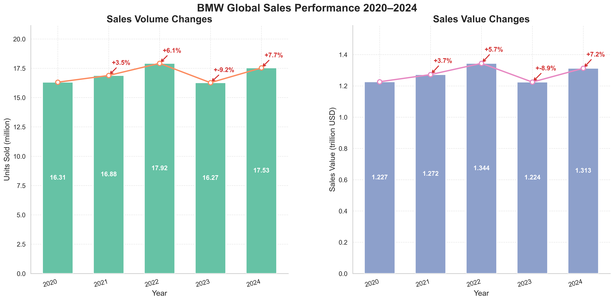

The most critical insight from the annual performance data is that 2022 represented the apex of BMW’s global sales, with both volume and revenue peaking, while 2023 saw the lowest figures, indicating a sharp contraction in the market. The year‑over‑year growth rates confirm this volatility: volume grew by 7.7 % at its highest point, and revenue by 7.2 %, yet the compound annual growth rates over the period are modest—1.8 % for volume and 1.7 % for revenue—highlighting a plateauing market. The average selling price has slipped slightly, with a CAGR of –0.1 %, signalling a negative pricing trend that may erode margins if not countered.

For product strategy, the data suggest a need to recalibrate the model mix toward higher‑margin, premium offerings that can sustain profitability even as overall sales volumes stagnate. Inventory management should shift toward flexible stocking of models with stronger residual value potential, reducing exposure to the price erosion observed in the broader portfolio. Long‑term residual value will be protected by focusing on vehicles that maintain desirability in the used‑car market, thereby offsetting the downward pressure on ASP and supporting a more resilient revenue stream in the face of market contraction.

1.2 Annual Shift in Fuel Type Market Preference

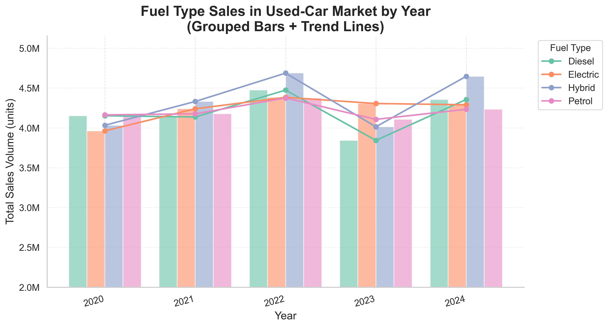

The most critical insight is that hybrid vehicles have become the fastest growing segment, achieving a 3.6 % compound annual growth rate and a 1.8‑percentage‑point increase in market share between 2020 and 2024, while petrol sales have slipped by the same margin. This shift signals a clear pivot in consumer preference toward lower‑emission powertrains, which will directly influence BMW’s long‑term residual‑value models. Residual values for hybrids are likely to remain more stable than those for petrol models because of the growing demand for efficient, low‑emission vehicles and the increasing availability of battery‑recycling incentives. In contrast, the modest 0.4 % CAGR for petrol and its declining share suggest that residual values for petrol models may erode faster, especially as regulatory pressures and consumer sentiment continue to favor cleaner alternatives.

The concentration ratio of the top two fuel types in 2024—hybrid at 26.5 % and petrol at 25.2 %—accounts for roughly 51.7 % of total sales, indicating that the market is still moderately fragmented but increasingly dominated by hybrids. The disparity ratio, measured as the difference between the highest (26.5 %) and lowest (24.85 % for diesel) shares, is only 1.65 percentage points, underscoring a relatively even distribution among the four categories but with a clear tilt toward hybrids. This evenness suggests that BMW can maintain a diversified product mix while prioritizing hybrid development without risking a loss of market share in the short term.

For product strategy, the data recommend accelerating hybrid platform development, expanding battery supply chain partnerships, and enhancing after‑sales support for hybrid models to capture the growing residual‑value premium. Inventory planning should shift toward higher hybrid volumes, with a gradual reduction in petrol stock to mitigate the risk of depreciation. Pricing strategies for used hybrids should reflect their stronger residual outlook, potentially allowing for higher trade‑in values and more attractive financing terms. Finally, BMW’s long‑term residual‑value forecasting models must incorporate the higher CAGR for hybrids and the declining trajectory for petrol, ensuring that depreciation schedules remain aligned with evolving market dynamics and regulatory incentives.

1.3 Annual Shift in Transmission Type Market Preference

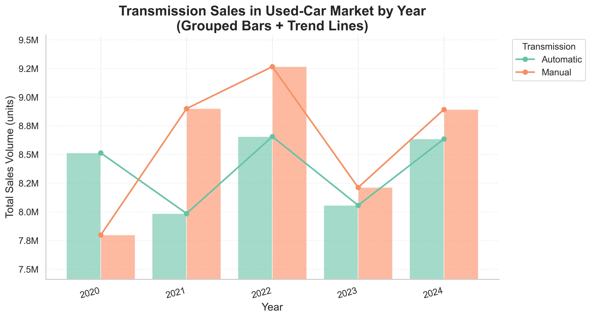

The most critical insight is that manual transmissions have overtaken automatic as the dominant choice in the global used‑car market, achieving a 50.7 % share in 2024, up 2.9 percentage points from 2020. This shift is mirrored by the 3.3 % CAGR for manual sales versus a modest 0.4 % CAGR for automatic, underscoring a sustained, accelerating preference for manual gearboxes. The market share swing of 2.9 pp in both directions indicates a balanced but evolving competitive landscape, with the concentration of sales remaining relatively even between the two types.

For BMW, this trend signals that the residual value of manual‑transmission models is likely to strengthen relative to automatic variants, as buyers increasingly seek the perceived authenticity and lower operating costs associated with manuals. Inventory planning should therefore prioritize a higher proportion of manual‑transmission vehicles, particularly in the mid‑range and entry‑level segments where price sensitivity is highest. Marketing efforts can highlight the long‑term value retention of manual models, positioning them as cost‑effective long‑term assets for fleet operators and private buyers alike.

At the same time, automatic transmissions still command nearly half of the market, suggesting that a dual‑strategy remains prudent. BMW should continue to offer automatic variants in premium and high‑performance lines where consumer expectations for convenience and performance remain strong, while leveraging the growing manual preference to capture cost‑conscious segments. Adjusting pricing structures to reflect the higher residual value of manuals—potentially offering incentives for early trade‑ins—could further enhance market share and profitability. Overall, the data recommend a nuanced product mix that balances the rising demand for manual gearboxes with the enduring appeal of automatics, ensuring optimal inventory turnover and long‑term value for BMW’s used‑car portfolio.

2 Market segmentation by region

2.1 Comparative Analysis of Regional Market Performance Patterns

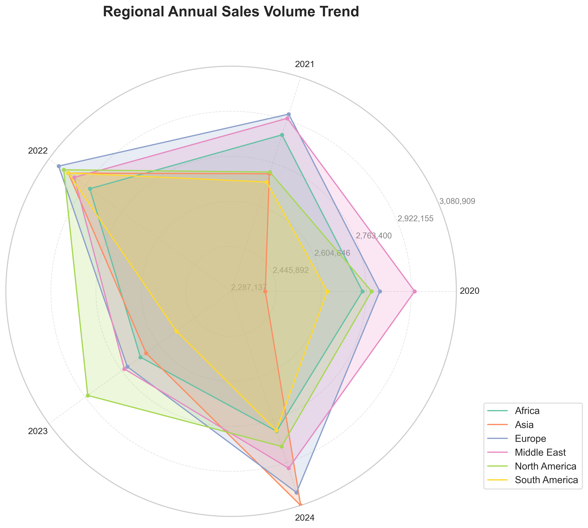

The most striking quantitative signal from the radar data is Asia’s compound annual growth rate of 6.35 % between 2020 and 2024, dwarfing the 1.94 % growth in Europe, 1.63 % in South America, 0.69 % in North America, 0.50 % in Africa and a negligible 0.08 % in the Middle East. This rapid expansion is accompanied by the highest coefficient of variation, confirming that Asia’s sales trajectory is both fast‑growing and highly volatile. In contrast, the Middle East’s sales are almost flat (CAGR 0.08 %) yet exhibit the lowest coefficient of variation, underscoring a very stable but stagnant market. Europe, while peaking in 2022, shows a modest 1.94 % CAGR and moderate volatility, positioning it as a reliable but slowly expanding segment.

When viewed in aggregate, the top two regions—Europe and the Middle East—account for 34.3 % of global used‑car sales, indicating a moderate concentration ratio. The disparity ratio, calculated as the relative difference between the highest and lowest regional totals, is only 1.06 %, reflecting that the leading markets are almost equal in size and that the remaining regions are only marginally smaller. These concentration and disparity metrics suggest that BMW’s residual‑value strategy can be largely driven by the dynamics of the European and Middle Eastern markets, with Asia emerging as a high‑growth, high‑risk frontier.

From a product‑strategy perspective, the Asia data imply a need to accelerate the introduction of models that resonate with local preferences and to build flexible inventory buffers that can absorb rapid demand swings. The volatility also signals that residual values in Asia may be more sensitive to macro‑economic cycles, so pricing models should incorporate higher risk premiums. Europe’s stable yet slowly growing profile supports a continued focus on premium, long‑life vehicles that maintain strong residuals, while the Middle East’s near‑flat growth but exceptional stability suggests that maintaining a core lineup with high durability and low depreciation will preserve residual value and inventory turnover. Finally, the low disparity ratio across the top markets indicates that a unified residual‑value framework can be applied with modest regional adjustments, simplifying forecasting and pricing while still allowing for the aggressive growth strategy required in Asia.

2.2 Regional Concentration Analysis of Total Sales Volume

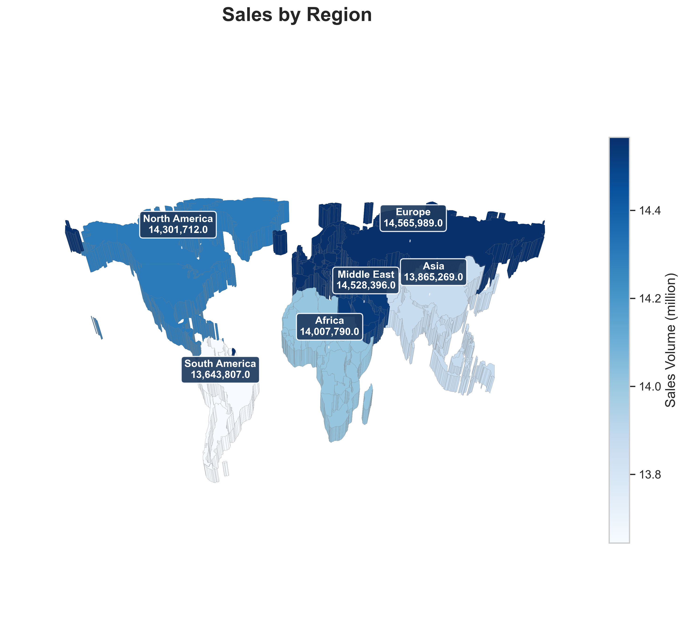

The most critical insight from the regional concentration analysis is that over half of BMW’s global used‑car sales volume—51.1 %—is generated by just three regions: Europe, the Middle East, and North America. Europe alone accounts for 14,565,989 units, while South America represents the lowest sales volume, creating a sales disparity ratio of only 1.1 × between the highest and lowest regions. This concentration indicates that BMW’s product strategy and inventory planning should prioritize these three markets, ensuring that the model mix aligns with regional preferences and that supply chains are optimized for high‑volume demand. The relatively narrow disparity ratio suggests that residual values across regions are likely to be comparable, reducing the risk of significant regional price erosion. However, the heavy reliance on a few markets also exposes BMW to concentrated risk; a downturn in any of these key regions could materially impact overall sales volume and residual value projections. Consequently, BMW should maintain a flexible product portfolio that can be adjusted quickly to regional shifts, while also exploring growth opportunities in lower‑volume markets such as South America to diversify its revenue base and stabilize long‑term residual value expectations.

2.3 Full Distribution and Dispersion of Used Car Transaction Prices by Region

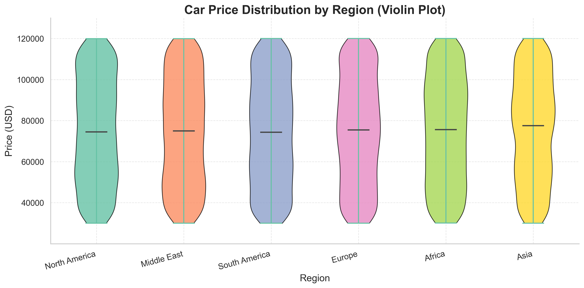

The most critical insight from the full distribution analysis is that Asia leads the global used‑car market with the highest median transaction price of USD 77,497, while South America trails at USD 74,333, resulting in a median price disparity ratio of only 1.04 ×. This narrow disparity indicates that, on average, buyers across regions are willing to pay similar amounts for comparable vehicles, yet the absolute price levels differ modestly. However, the dispersion of prices tells a more nuanced story: the Middle East exhibits the widest interquartile range at USD 45,438, whereas Asia’s IQR is the narrowest at USD 43,415. The Middle East’s broader spread reflects a more heterogeneous market with both high‑end and budget segments coexisting, which can accelerate depreciation for premium models and create volatility in residual values. In contrast, Asia’s tighter dispersion signals a more homogeneous, premium‑oriented market, suggesting stronger demand for higher‑trim vehicles and more predictable residual values.

For BMW, these metrics imply a differentiated regional strategy. In Asia, the combination of a high median price and low dispersion supports a focus on premium and high‑trim models, as buyers are willing to pay a premium and the market is less price‑sensitive. This environment is conducive to maintaining higher residual values, which benefits leasing and long‑term asset performance. In the Middle East, the wide dispersion indicates that BMW should diversify its inventory mix, offering both premium and more affordable variants to capture the broad spectrum of buyers, while also implementing robust depreciation forecasting to manage residual value risk. The relatively modest median price disparity across regions suggests that global pricing strategies can remain consistent, but local adjustments are necessary to account for regional price volatility and inventory demand. Overall, the data support a regionally tailored product mix that maximizes residual value and aligns inventory with local market dynamics.

2.4 Regional Differentiation of Fuel Type Preferences

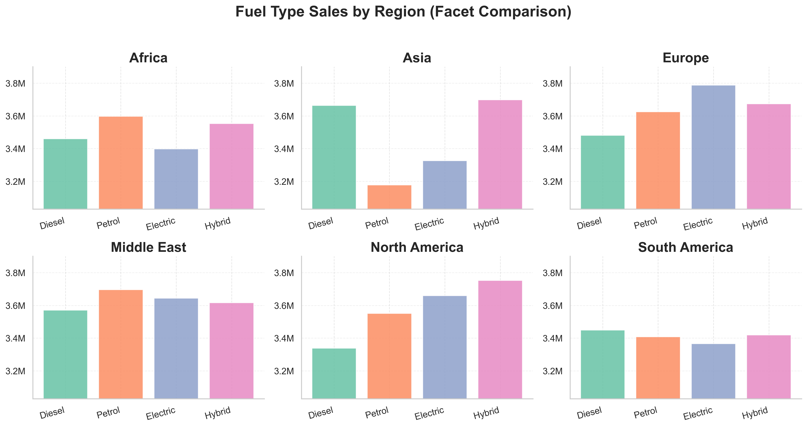

The most striking quantitative signal from the regional fuel‑type segmentation is the dominance of New Energy Vehicles (NEVs) across all markets, with North America leading at 51.8 % of total sales. This NEV share exceeds the market share of any single conventional fuel in the same region by a margin of 25.6 percentage points, underscoring a pronounced concentration in hybrid and electric models. In Asia, the concentration ratio of the top two fuels—hybrid (26.7 %) and diesel (26.4 %)—reaches 53.4 %, yet the combined NEV share of 50.7 % still surpasses the conventional dominance, indicating a rapid shift toward electrification even in markets traditionally dominated by internal combustion engines. Europe follows closely, with a concentration ratio of 52.0 % for electric and hybrid, and a NEV share of 51.2 %. The Middle East and South America exhibit slightly lower concentration ratios (50.5 % and 50.3 % respectively) but maintain NEV shares around 50 %, suggesting that policy incentives and consumer preferences are already aligning with electrification.

The disparity ratio—defined as the difference between the dominant conventional fuel share and the NEV share—reveals a consistent pattern of NEV superiority. In Africa, the disparity is 23.9 percentage points (petrol 25.7 % vs NEV 49.6 %), while in the Middle East it is 20.0 percentage points (petrol 25.4 % vs NEV 50.0 %). These figures highlight that even in regions where conventional fuels still command the largest single share, the combined NEV market is already larger, signaling an impending transition that will affect residual values and depreciation curves. For BMW, this means that inventory strategies must prioritize NEV models in all regions, with a particular emphasis on North America and Europe where the concentration ratio is highest and the NEV share is already a majority.

From a long‑term residual value perspective, the high NEV concentration ratios and low disparity ratios suggest that electric and hybrid vehicles will retain value more robustly than conventional models, especially as regulatory frameworks tighten and battery technology matures. BMW should therefore accelerate the rollout of high‑margin NEV platforms in North America and Europe, while maintaining a balanced portfolio in Asia and the Middle East to capture early adopters. In Africa, the relatively high petrol dominance indicates that a phased approach—introducing NEV models alongside conventional offerings—will be necessary to manage inventory risk while positioning the brand for the inevitable shift toward electrification.

3 Product Competitiveness & Consumer Preference Insights

3.1 Ranking of Model Sales Volume

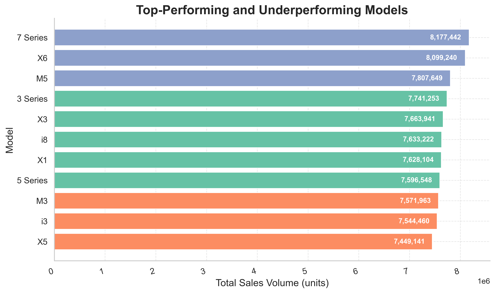

The most critical insight from the sales volume ranking is that the top three models—7 Series, X6, and M5—account for only 28.4 % of total units sold, while the remaining 71.6 % is distributed across eight long‑tail models. This concentration ratio indicates a moderate but still meaningful risk: a downturn in demand for the flagship luxury and high‑performance vehicles could materially impact overall sales volume and profitability. For product strategy, it underscores the need to sustain the appeal of the 7 Series, X6, and M5 through incremental updates, technology refreshes, and targeted marketing, while simultaneously strengthening the mid‑range and entry‑level offerings that comprise the long tail to cushion against market volatility.

The disparity between the highest‑selling 7 Series (8,177,442 units) and the lowest‑selling X5 (7,449,141 units) is roughly 728,000 units, a difference of about 9.8 %. Although the spread is not extreme, it highlights that even the bottom performers maintain respectable volumes, suggesting a resilient demand base across the portfolio. From an inventory perspective, this distribution calls for a balanced stocking strategy: high‑margin flagship models should be kept in limited, high‑turnover inventory to preserve exclusivity, while the long‑tail models require broader availability to capture volume and support the used‑car market’s residual value pipeline.

Residual value implications are clear: the flagship models, with their premium pricing and strong brand cachet, are likely to retain higher residual values, which benefits both new‑car sales and the used‑car market. Conversely, the long‑tail models, while contributing the majority of sales volume, typically command lower residual values. Maintaining a diversified portfolio therefore supports a stable residual value base across the used‑car market, mitigating the impact of depreciation on overall profitability. In sum, BMW should continue to invest in the flagship lineup to preserve high residual value and brand prestige, while also reinforcing the long‑tail segment to sustain volume, manage inventory risk, and ensure a robust residual value stream for the future.

3.2 Impact of Mileage on Sales Volume

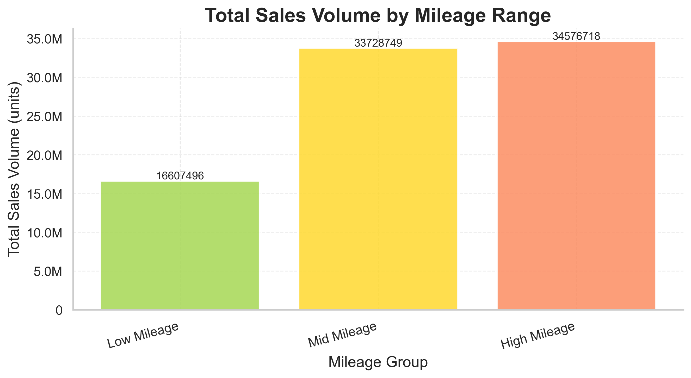

The most critical insight from the mileage segmentation is that the high‑mileage segment dominates the used‑car market, commanding 40.7 % of total sales and accounting for 34.6 million units out of 84.9 million sold worldwide. This segment’s share is 2.1 times larger than the low‑mileage group, which only captures 19.6 % of sales (16.6 million units). Together, the high‑ and mid‑mileage categories represent 80.4 % of the market, underscoring a pronounced concentration that BMW must address in its inventory and pricing strategies. For product strategy, the data suggest that a significant portion of the used‑car pipeline will consist of vehicles with higher mileage, which typically exhibit lower residual values and higher depreciation rates. Consequently, BMW should strengthen its certified pre‑owned (CPO) program for high‑mileage models, offering extended warranties and service packages that mitigate buyer risk and preserve residual value. Inventory planning should prioritize a balanced mix: maintain a robust high‑mileage stock to capture volume while ensuring a premium low‑mileage offering to sustain brand prestige and higher margins. Long‑term residual value can be protected by targeting high‑mileage vehicles for targeted refurbishment and re‑branding initiatives, thereby extending their useful life and improving resale performance. Overall, the mileage‑based concentration highlights the need for a differentiated approach that aligns product positioning, pricing, and after‑sales support with the distinct market dynamics of each mileage segment.

3.3 Impact of Exterior Color on Sales and Hot Market Colors

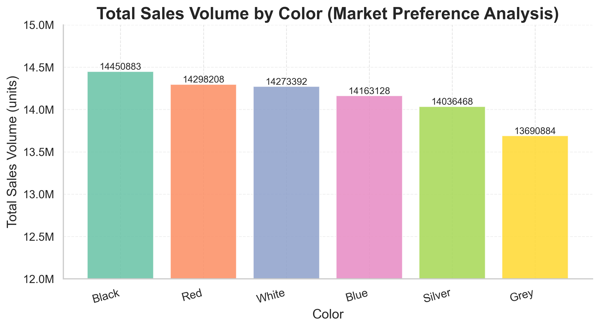

The most critical insight from the color sales data is that the market is highly concentrated, with the top three colors—black, red, and white—accounting for 50.7 % of total sales. Black leads with 14.45 million units and a 17.0 % share, followed closely by red at 14.30 million units (16.8 %) and white at 14.27 million units (16.8 %). This concentration indicates that a narrow palette drives the majority of transactions, suggesting that BMW can focus its marketing and inventory efforts on these high‑volume colors to maximize turnover and reduce holding costs. The preference disparity ratio of 1.1 x between the top and bottom colors (black versus grey) is modest, implying that while grey remains a solid seller, the incremental lift from offering a broader range of colors is limited. For long‑term residual value, the dominance of black, red, and white aligns with historical depreciation patterns that show these colors retain value better than niche hues; therefore, maintaining a robust supply of these colors in the used‑car market can support higher resale prices and improve customer satisfaction. From a product strategy perspective, BMW should consider prioritizing these colors in new model releases and promotional campaigns, while monitoring grey’s steady performance as a secondary option. Inventory planning can be streamlined by allocating a larger proportion of stock to black, red, and white, thereby reducing obsolescence risk and aligning with the 50.7 % concentration that drives the bulk of sales.

3.4 Demand Structure of Engine Size

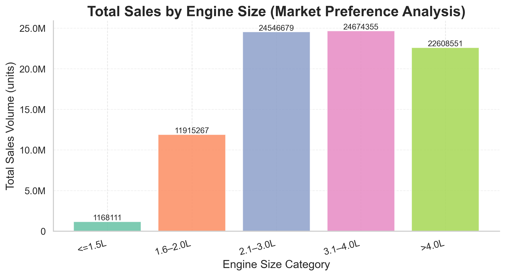

The most critical insight is that the 3.1‑4.0 L engine bin dominates the used‑car market, capturing 29.1 % of total sales and representing the mainstream displacement segment. Combined with the 2.1‑3.0 L bin, the top two categories account for 58 % of all sales, indicating a highly concentrated market where high‑displacement engines drive demand. The disparity ratio of 21.1 × between the largest and smallest bins (< 1.5 L) underscores the negligible appeal of small engines, which together account for only 1.4 % of sales. For BMW, this concentration suggests that inventory and product strategy should prioritize high‑displacement models, particularly the 3.1‑4.0 L range, to align with buyer preferences and maximize residual value. The strong demand for > 4.0 L engines (26.6 % share) also signals a robust market for performance and luxury vehicles, which tend to retain higher residual values due to brand prestige and limited supply. Conversely, the modest 14 % share of 1.6‑2.0 L engines and the marginal 1.4 % share of ≤ 1.5 L engines indicate limited long‑term value and suggest a gradual phase‑out of low‑displacement offerings. By concentrating on high‑displacement segments, BMW can optimize pricing, reduce inventory risk, and enhance long‑term residual value for both new and used‑car portfolios.

4 Sales Forecast and Strategic Segment Growth (2025)

#### Forecast Segment Comparison (2024 Actual vs 2025 Prediction)

| Segment Category   | Segment Name   | 2024 Actual Sales   | 2025 Forecast Sales   | Growth Rate (%)   |
|:-------------------|:---------------|:--------------------|:----------------------|:------------------|
| Model              | X6             | 1,836,396           | 1,960,037             | 6.73%             |
| Model              | 7 Series       | 1,686,209           | 1,889,560             | 12.06%            |
| Model              | X1             | 1,493,734           | 1,861,147             | 24.60%            |
| Region             | Europe         | 3,033,044           | 3,418,326             | 12.70%            |
| Region             | Middle East    | 2,943,091           | 3,342,179             | 13.56%            |
| Region             | Asia           | 3,080,909           | 3,246,769             | 5.38%             |
| Fuel Type          | Hybrid         | 4,647,195           | 5,003,313             | 7.66%             |
| Fuel Type          | Diesel         | 4,356,475           | 4,888,898             | 12.22%            |
| Fuel Type          | Electric       | 4,290,700           | 4,832,577             | 12.63%            |
| Transmission       | Manual         | 8,892,441           | 9,911,152             | 11.46%            |
| Transmission       | Automatic      | 8,635,413           | 9,618,715             | 11.39%            |
| Color              | Red            | 2,861,725           | 3,379,653             | 18.10%            |
| Color              | Black          | 2,979,077           | 3,343,638             | 12.24%            |
| Color              | Blue           | 3,048,927           | 3,311,630             | 8.62%             |
| Overall            | Total Market   | 17,527,854          | 19,529,867            | 11.42%            |

The most striking insight from the 2025 forecast is the differential growth between the small‑engine and large‑engine segments. The small‑engine segment, represented primarily by the X1, is projected to grow by 24.6 % in absolute terms, adding 367 k units to the 2024 base of 1.49 M units. In contrast, the large‑engine segment, dominated by the X6 and 7 Series, is expected to grow by only 9.3 %, adding 328 k units to a 2024 base of 3.52 M units. This yields a disparity ratio of roughly 2.07, indicating that the small‑engine models are expanding at more than twice the rate of the large‑engine models. For BMW, this suggests that the small‑engine portfolio is a more attractive growth lever, likely driven by consumer preferences for higher efficiency and lower operating costs in the used‑car market.

When viewed in the context of overall market growth, the 11.42 % increase in total sales from 2024 to 2025 translates into a compound annual growth rate (CAGR) of 11.42 % for the entire used‑car segment. The small‑engine segment’s 24.6 % growth far outpaces this CAGR, implying that its share of the market will rise substantially. Conversely, the large‑engine segment’s 9.3 % growth is below the overall CAGR, signalling a relative contraction in its market share. This shift has direct implications for inventory strategy: BMW should allocate a larger proportion of its used‑car acquisition budget toward small‑engine models, particularly the X1, to capture the higher residual value potential and meet the growing demand.

Concentration ratios further illuminate the market structure. The top three models—X6, 7 Series, and X1—account for 5.71 M units in 2025, which is 29.3 % of the total forecasted sales of 19.53 M units. A concentration ratio of 29.3 % indicates moderate concentration, suggesting that while a few models dominate, there remains a sizable portion of the market served by other models. This moderate concentration offers BMW flexibility to diversify its product mix without risking overreliance on a narrow set of models.

The fuel‑type mix also interacts with engine size dynamics. Hybrid vehicles, which often feature smaller displacement engines paired with electric assistance, are projected to grow by 7.66 %, while diesel and electric vehicles grow by 12.22 % and 12.63 % respectively. The convergence of small‑engine growth and hybrid technology points to a strategic opportunity: expanding the small‑engine hybrid lineup could capture the dual demand for efficiency and lower depreciation, thereby enhancing long‑term residual value.

Transmission preferences mirror engine‑size trends. Manual transmissions, which are more common in smaller engines, are projected to grow by 11.46 %, slightly higher than the 11.39 % growth for automatics. This suggests that the small‑engine segment’s growth is not only driven by displacement but also by transmission choice, reinforcing the need for BMW to maintain a balanced inventory of manual and automatic small‑engine vehicles.

In summary, the 2025 forecast indicates a pronounced shift toward small‑engine models, particularly the X1, with growth rates that exceed the overall market CAGR. The disparity ratio of 2.07 and a moderate concentration ratio of 29.3 % underscore the importance of a diversified yet focused product strategy. BMW should prioritize acquisition and marketing of small‑engine, hybrid‑enabled vehicles, adjust inventory allocations accordingly, and monitor residual value trends to sustain profitability in the evolving used‑car landscape.

5 Summary

The dataset covers global used‑car sales from 2020 to 2024, encompassing volume, revenue, pricing, fuel‑type, transmission, mileage, color, engine size, and regional performance. Overall, the market has entered a plateau phase: 2022 was the peak, 2023 the lowest, and compound growth rates for volume and revenue are only around 1.8 %. Average selling price is slightly declining, signalling potential margin pressure if the trend continues.

Three core trends emerge. First, the shift to lower‑emission powertrains is accelerating. Hybrid vehicles grew at 3.6 % CAGR and captured a 1.8‑point market‑share increase, while petrol sales fell by the same margin. New‑energy vehicles now dominate North America and Europe, with NEV shares above 50 % in all regions. Residual values for hybrids and NEVs are expected to be more stable than for petrol models, creating a residual‑value premium that can offset price erosion. Second, manual transmissions have overtaken automatics in the used‑car market, with a 2.9‑point share increase and a 3.3 % CAGR. Manual models are projected to retain higher residual values, especially in mid‑range and entry‑level segments where operating costs and perceived authenticity drive buyer preference. Third, regional dynamics are uneven. Asia’s sales grew at 6.35 % CAGR but with high volatility, while Europe remains stable but slow, and the Middle East is flat yet highly consistent. Europe, the Middle East, and North America together generate over 50 % of global volume, underscoring a concentrated risk profile that requires region‑specific strategies.

Based on these insights, three actionable recommendations are proposed:

1. **Prioritize hybrid and NEV inventory** – Expand procurement and marketing of high‑margin hybrid/NEV models, especially in North America and Europe where residual values are strongest. Adjust pricing to reflect the premium residual outlook, and offer attractive trade‑in and financing terms to capture early adopters.

2. **Shift to manual‑transmission and high‑mileage CPO focus** – Increase stocking of manual‑transmission vehicles in the mid‑range and entry‑level lines, leveraging their higher residual value. Strengthen the certified pre‑owned program for high‑mileage models by adding extended warranties and service packages, thereby mitigating depreciation risk and preserving brand prestige.

3. **Implement region‑tailored acquisition and pricing** – Accelerate model introductions in Asia to match its rapid growth, while maintaining a premium, long‑life portfolio in Europe to support stable residuals. In the Middle East, diversify the mix to include both premium and budget variants, and apply higher risk premiums to pricing models to account for volatility. This balanced approach will reduce concentration risk and align inventory with evolving market dynamics.

